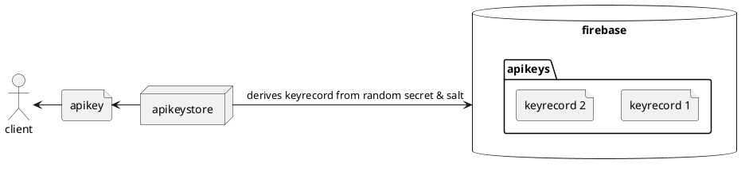
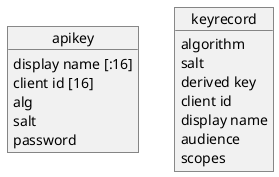
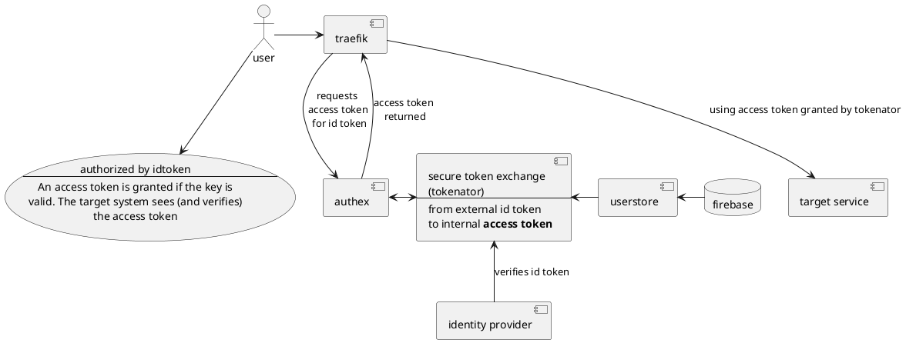
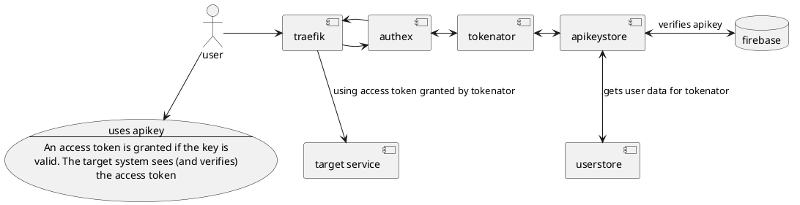
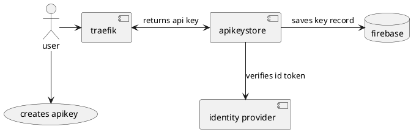
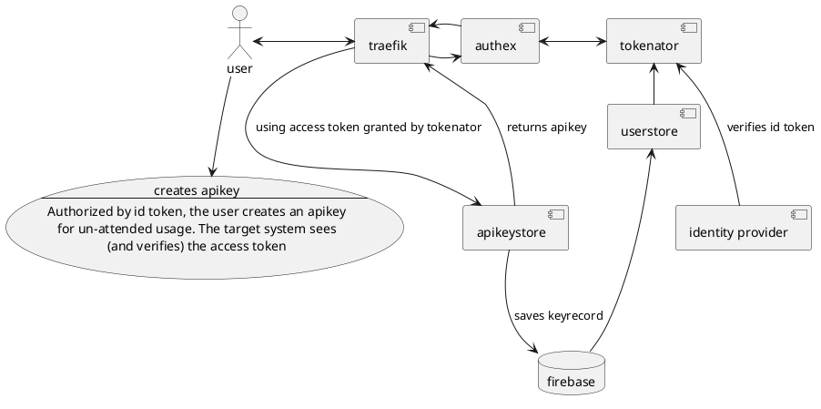

# user management

All persistent data is, by default, in firestore. This includes application specific user material.

The secret in the api key is randomly generated and is never stored by the system. The user gets once chance to record it. To use the key the user presents the orignal secret (and its accompanying metadata) encoded as a base64 token string. The system derives a key from the token and checks the database for the derived key. The derived key is its own database record primary key. If it is not found, the secret api key is not valid. The user will have access denied. 

The key record contains the derived key only, and any metadata necessary for handing out access tokens based on the apikey when it is presented. The password and salt are both randomly generated and are returned ONCE to the user when the api key is created.

## Authorization by id token (typical user session)

Normal picture for access to a target system looks like this. Essentially, we always to a secure token exchange from the external identity provider token to our application specific access token prior to accessing any internal service.

# Authorization by apikey

Assuming the use has already obtained the api key, the use of it looks like this:

## Option 1 for creating the apikey

Its tempting to short circuit the unified model for access token grants for api key creation. Eg

The odity here is that apikeystore *is* the target service and is verifying the
id token directly. Typically, we leave this to tokenator. But this model is simpler.

## Option 2 for creating the apikey

If we expand target service to include what happens when its the apikeystore
apikey creation endpoint we get this picture.

## Choosing Option 2

We only want a single place where we mint access tokens and verify external identity provider tokens. And tokenator (being based on node-oidc-provider) is the place we do that.

## Adendum

It may make sense to combine authex and tokenator. Or at least arrange for authex to be a minimal proxy for tokenator that simply satisfies the requrements of traefik forwardauth.

Further, the keyrecord is really best viewed as an openid connect client definition. Every apikey created by the user is an independent client whose secret is known to the user. When we create the keyrecord we can record the creating user (and any other relations we like) in the record.